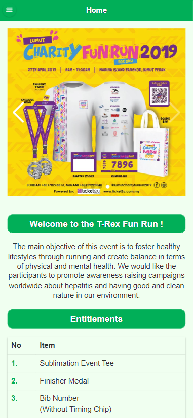
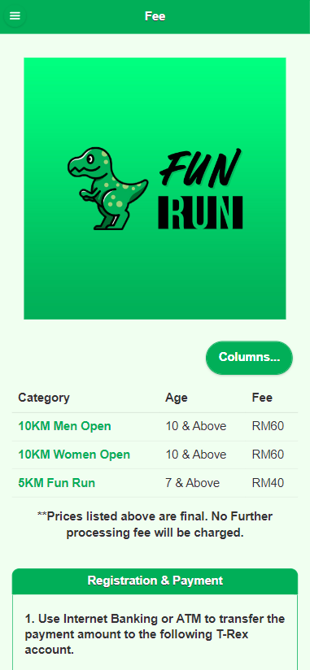
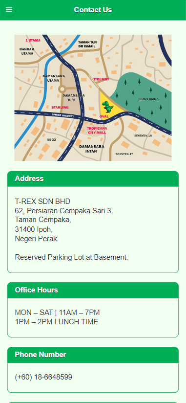

## The Great Johore Burger Order System (GJB)

   

{ width=300px }
{ width=300px }
{ width=300px }
{ width=300px }
{ width=300px }

## Welcome! 👋

T-Rex Fun Run application for web design technologies project assessment.
